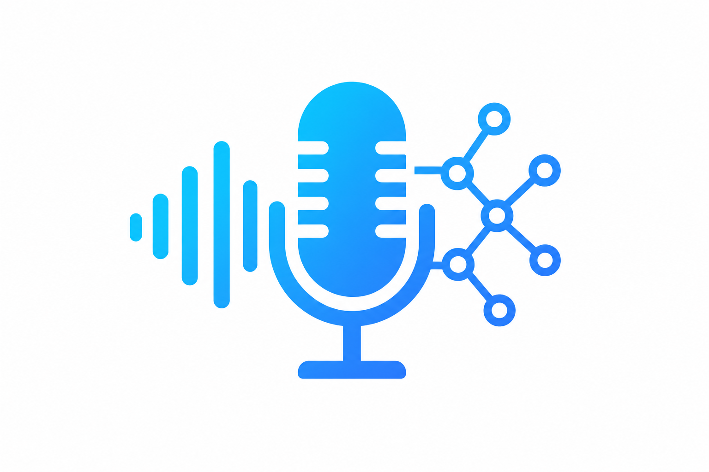

<p align="center">
  
</p>

<h1 align="center">FlashAudio</h1>

<p align="center">
  <a href="https://pypi.org/project/flashaudio/"></a>
  <a href="https://github.com/FlashVision/FlashAudio/actions"></a>
  
  
  
  
  
  
</p>

<p align="center">
  <b>Production-grade Audio & Speech AI — STT, TTS, voice cloning, audio generation, and analysis</b>
</p>

<p align="center">
  <a href="#installation">Install</a> •
  <a href="#usage">Usage</a> •
  <a href="#speech-to-text">STT</a> •
  <a href="#text-to-speech">TTS</a> •
  <a href="#voice-cloning">Voice Cloning</a> •
  <a href="#audio-classification">Classification</a> •
  <a href="#examples">Examples</a> •
  <a href="#contributing">Contributing</a>
</p>

---

## What is FlashAudio?

FlashAudio is an end-to-end framework for Audio & Speech AI — from speech recognition to synthesis and audio generation. It provides a `pip`-installable Python package with a CLI, a high-level Python API, and built-in solutions for transcription, narration, and audio analysis.

```bash
pip install -e .
flashaudio transcribe --audio recording.wav
flashaudio speak --text "Hello world" --output hello.wav
flashaudio classify --audio sound.wav
```

---

## Installation

### pip (recommended)

```bash
pip install flashaudio

# With all extras (analytics, export)
pip install "flashaudio[all]"
```

### From source (for development)

```bash
git clone https://github.com/FlashVision/FlashAudio.git
cd FlashAudio
pip install -e ".[all]"
```

### Optional extras

```bash
pip install -e ".[analytics]"     # Matplotlib plots, pandas
pip install -e ".[export]"        # ONNX export
pip install -e ".[all]"           # Everything
```

### Verify installation

```bash
flashaudio check       # runs full health check
flashaudio settings    # shows Python, PyTorch, CUDA, GPU info
flashaudio version     # prints version
```

---

## Usage

### Python API

```python
from flashaudio import FlashAudio, Trainer, Predictor, Exporter

# Speech-to-Text
model = FlashAudio(task="stt", model_id="openai/whisper-base")
result = model.transcribe("recording.wav")
print(result["text"])

# Text-to-Speech
model = FlashAudio(task="tts")
model.synthesize("Hello, world!", output_path="hello.wav")

# Audio Classification
model = FlashAudio(task="classification")
labels = model.classify("sound.wav")
print(labels)
```

### CLI

```bash
# Transcribe audio
flashaudio transcribe --audio recording.wav --model openai/whisper-base

# Generate speech
flashaudio speak --text "Welcome to FlashAudio" --output welcome.wav

# Classify audio
flashaudio classify --audio sound.wav

# Train a model
flashaudio train --config configs/flashaudio_stt.yaml

# Benchmark
flashaudio benchmark --model openai/whisper-base --task stt
```

---

## Speech-to-Text

Whisper-based speech recognition with language detection and word-level timestamps:

```python
from flashaudio.speech import SpeechToText

stt = SpeechToText(model_id="openai/whisper-base", device="cuda")
result = stt.transcribe("audio.wav", language="en", word_timestamps=True)
print(result["text"])
print(result["segments"])
```

---

## Text-to-Speech

Mel spectrogram + vocoder-based speech synthesis:

```python
from flashaudio.speech import TextToSpeech

tts = TextToSpeech(device="cuda")
tts.synthesize("Hello from FlashAudio!", output_path="output.wav", sample_rate=22050)
```

---

## Voice Cloning

Speaker embedding extraction and conditioned synthesis:

```python
from flashaudio.speech import VoiceCloner

cloner = VoiceCloner(device="cuda")
embedding = cloner.extract_speaker_embedding("reference.wav")
cloner.clone("Say this in the reference voice", embedding, output_path="cloned.wav")
```

---

## Audio Classification

Audio event classification with AudioSet labels:

```python
from flashaudio.audio import AudioClassifier

classifier = AudioClassifier(device="cuda")
predictions = classifier.classify("sound.wav", top_k=5)
for label, score in predictions:
    print(f"  {label}: {score:.3f}")
```

---

## Examples

See the `examples/` folder for complete scripts:

| Script | Description |
|--------|-------------|
| `speech_to_text.py` | Transcribe audio files with Whisper |
| `text_to_speech.py` | Generate speech from text |
| `voice_cloning.py` | Clone a voice from reference audio |
| `audio_classify.py` | Classify audio events |
| `benchmark_audio.py` | Benchmark model speed and accuracy |

---

## Contributing

See [CONTRIBUTING.md](CONTRIBUTING.md) for guidelines.

## License

[MIT](LICENSE) — see the LICENSE file for details.
